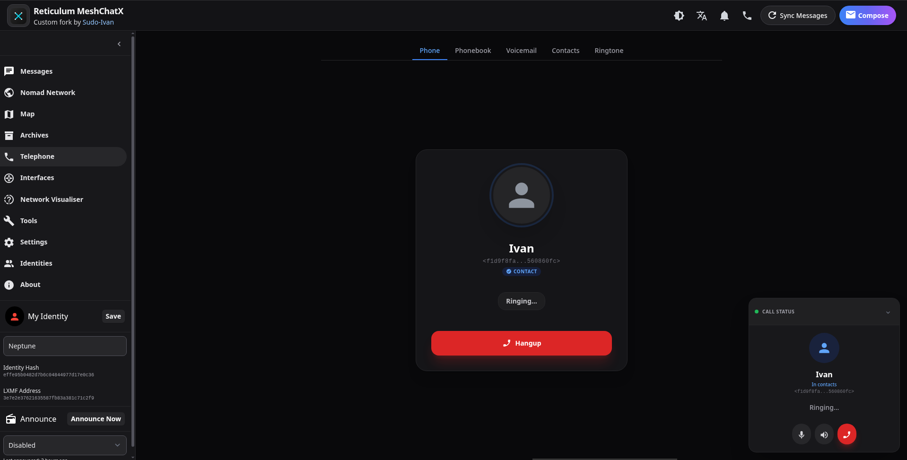
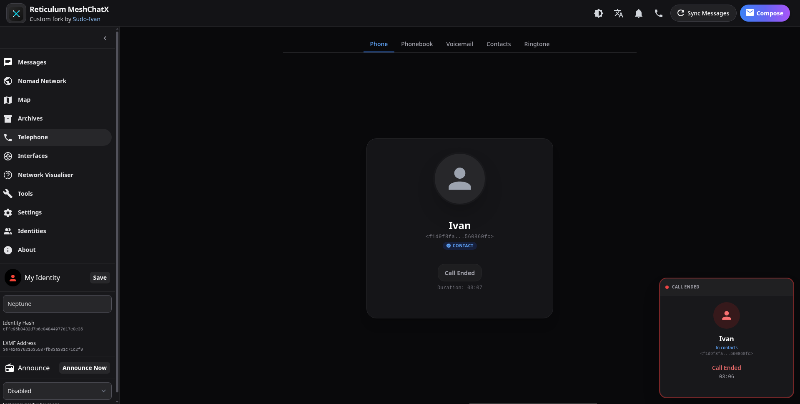
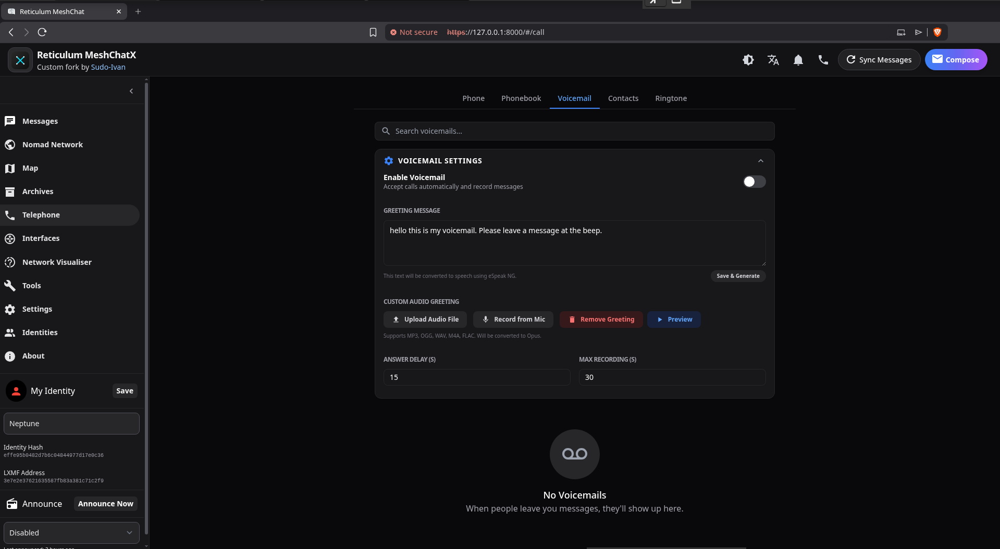
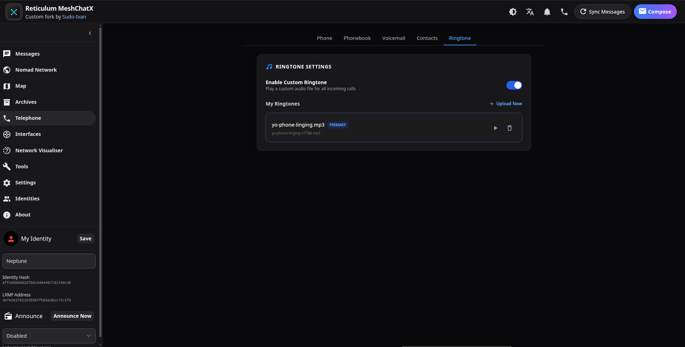
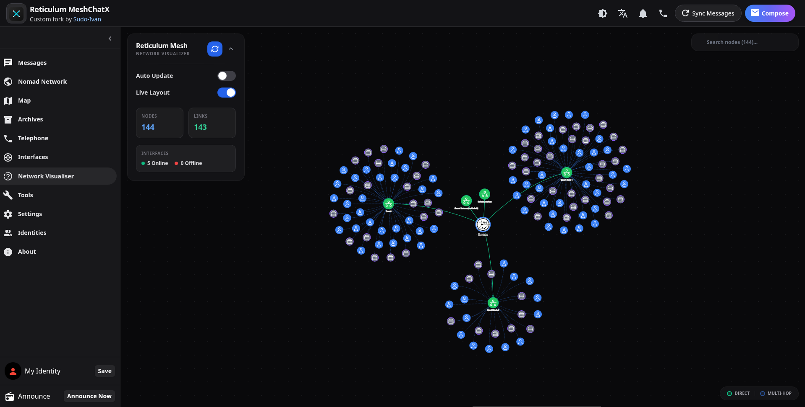
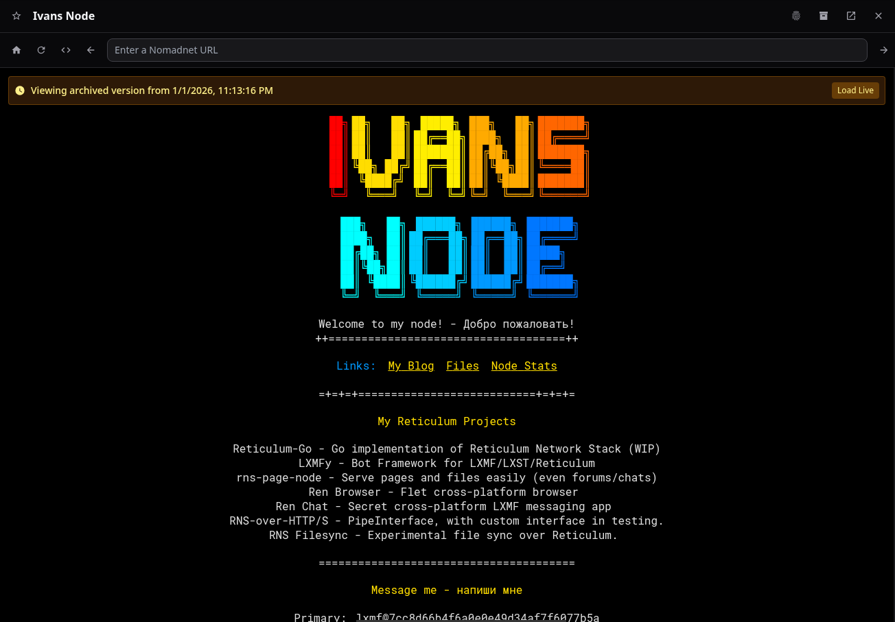
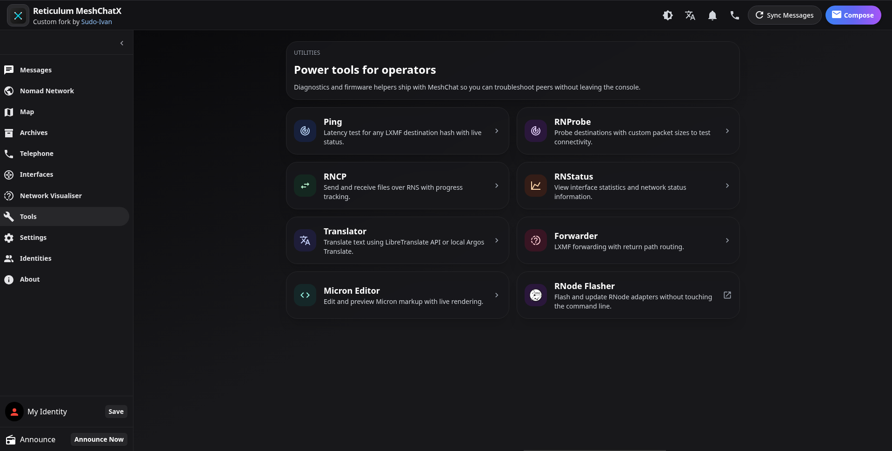

# Reticulum MeshChatX

A [Reticulum MeshChat](https://github.com/liamcottle/reticulum-meshchat) fork from the future.

<video src="https://strg.0rbitzer0.net/raw/62926a2a-0a9a-4f44-a5f6-000dd60deac1.mp4" controls="controls" style="max-width: 100%;"></video>

This project is seperate from the original Reticulum MeshChat project, and is not affiliated with the original project.

> [!WARNING]  
> Backup your reticulum-meshchat folder before using, even though MeshChatX will attempt to auto-migrate whatever it can from the old database without breaking things. Its best to keep backups.

## Major Features

- Full LXST support w/ custom voicemail, phonebook, contacts, contact sharing and ringtone support.
- RNS Hot Restart: Reload the entire Reticulum stack from settings without restarting the app.
- Multi-identity support.
- Authentication
- Map (OpenLayers w/ MBTiles upload and exporter for offline maps)
- Security improvements (automatic HTTPS, CORS, and much more)
- Modern Custom UI/UX
- More Tools (RNStatus, RNProbe, RNCP and Translator)
- Built-in page archiving and automatic crawler.
- Block LXMF users, Telephony and NomadNet Nodes
- Toast system for notifications
- i18n support (En, De, Ru)
- Raw SQLite database backend (replaced Peewee ORM)
- LXMF Telemetry support (WIP)

## Screenshots

<details>
<summary>Telephony & Calling</summary>

### Phone


### Active Call



### Call Ended



### Voicemail



### Ringtone Settings



</details>

<details>
<summary>Networking & Visualization</summary>

### Network Visualiser




</details>

<details>
<summary>Page Archives</summary>

### Archives Browser


### Viewing Archived Page



</details>

<details>
<summary>Tools & Identities</summary>

### Tools



### Identity Management


</details>

## TODO

- [ ] RNS hot reload fix
- [ ] Offline Reticulum documentation tool
- [ ] Spam filter (based on keywords)
- [ ] TAK tool/integration
- [ ] RNS Tunnel - tunnel your regular services over RNS to another MeshchatX user.
- [ ] RNS Filesync - P2P file sync
- [ ] RNS Page Node

## Usage

Check [releases](https://git.quad4.io/Ivan/MeshChatX/releases) for pre-built binaries or appimages.

### Manual Installation (Bare Metal)

If you prefer not to use Docker or pre-built binaries, you can install MeshChatX manually:

1. **Clone the repository**:

    ```bash
    git clone https://git.quad4.io/RNS-Things/MeshChatX
    cd MeshChatX
    ```

2. **Install Node.js dependencies**:

    ```bash
    corepack enable
    pnpm install
    ```

3. **Install Python dependencies**:

    ```bash
    # It is recommended to use a virtual environment
    pip install poetry
    poetry install
    ```

4. **Build the frontend**:

    ```bash
    pnpm run build-frontend
    ```

5. **Run MeshChatX**:
    ```bash
    poetry run meshchat --headless --host 127.0.0.1
    ```

## Architecture Support (ARM64, etc.)

MeshChatX fully supports **ARM64** (Raspberry Pi, Pine64, etc.) and other architectures via Docker or manual installation.

### Docker (Recommended for ARM64)

The official Docker image is multi-arch and supports `linux/amd64` and `linux/arm64`.

```bash
# On a Raspberry Pi, simply pull and run
docker pull git.quad4.io/rns-things/meshchatx:latest
```

### Manual Build for ARM64

If you are building your own multi-arch image:

```bash
DOCKER_PLATFORMS=linux/amd64,linux/arm64 task build-docker
```

## Configuration

MeshChatX can be configured via command-line arguments or environment variables. Environment variables are particularly useful when running in Docker.

| Argument                 | Environment Variable            | Default        | Description                                  |
| :----------------------- | :------------------------------ | :------------- | :------------------------------------------- |
| `--host`                 | `MESHCHAT_HOST`                 | `127.0.0.1`    | The address the web server should listen on. |
| `--port`                 | `MESHCHAT_PORT`                 | `8000`         | The port the web server should listen on.    |
| `--no-https`             | `MESHCHAT_NO_HTTPS`             | `false`        | Disable HTTPS and use HTTP instead.          |
| `--headless`             | `MESHCHAT_HEADLESS`             | `false`        | Don't launch the web browser automatically.  |
| `--auth`                 | `MESHCHAT_AUTH`                 | `false`        | Enable basic authentication.                 |
| `--auto-recover`         | `MESHCHAT_AUTO_RECOVER`         | `false`        | Attempt auto-recovery of SQLite database.    |
| `--storage-dir`          | `MESHCHAT_STORAGE_DIR`          | `./storage`    | Path for databases and config files.         |
| `--reticulum-config-dir` | `MESHCHAT_RETICULUM_CONFIG_DIR` | `~/.reticulum` | Path to Reticulum config directory.          |
| `--identity-file`        | `MESHCHAT_IDENTITY_FILE`        | -              | Path to a Reticulum Identity file.           |
| `--identity-base64`      | `MESHCHAT_IDENTITY_BASE64`      | -              | Base64 encoded Reticulum Identity.           |
| `--identity-base32`      | `MESHCHAT_IDENTITY_BASE32`      | -              | Base32 encoded Reticulum Identity.           |

## Building

This project uses [Task](https://taskfile.dev/) for build automation. Install Task first, then:

```bash
task install   # installs Python deps via Poetry and Node deps via pnpm
task build
```

### Development with Nix

If you use [Nix](https://nixos.org/), a `flake.nix` is provided for a complete development environment including Python, Node.js, and all packaging tools.

```bash
nix develop
```

You can run `task run` or `task develop` (a thin alias) to start the backend + frontend loop locally through `poetry run meshchat`.

### Available Tasks

| Task                         | Description                                                                     |
| ---------------------------- | ------------------------------------------------------------------------------- |
| `task install`               | Install all dependencies (syncs version, installs node modules and python deps) |
| `task node_modules`          | Install Node.js dependencies only                                               |
| `task python`                | Install Python dependencies using Poetry only                                   |
| `task sync-version`          | Sync version numbers across project files                                       |
| `task run`                   | Run the application                                                             |
| `task develop`               | Run the application in development mode (alias for `run`)                       |
| `task build`                 | Build the application (frontend and backend)                                    |
| `task build-frontend`        | Build only the frontend                                                         |
| `task clean`                 | Clean build artifacts and dependencies                                          |
| `task wheel`                 | Build Python wheel package (outputs to `python-dist/`)                          |
| `task build-appimage`        | Build Linux AppImage                                                            |
| `task build-exe`             | Build Windows portable executable                                               |
| `task dist`                  | Build distribution (defaults to AppImage)                                       |
| `task electron-legacy`       | Install legacy Electron version                                                 |
| `task build-appimage-legacy` | Build Linux AppImage with legacy Electron version                               |
| `task build-exe-legacy`      | Build Windows portable executable with legacy Electron version                  |
| `task build-docker`          | Build Docker image using buildx                                                 |
| `task run-docker`            | Run Docker container using docker-compose                                       |

All tasks support environment variable overrides. For example:

- `PYTHON=python3.12 task install`
- `DOCKER_PLATFORMS=linux/amd64,linux/arm64 task build-docker`

### Python Packaging

The backend uses Poetry with `pyproject.toml` for dependency management and packaging. `package.json` is the source of truth for the project version. When you run `task install` (or any task that builds/runs the app), the version is automatically synced to `pyproject.toml` and `src/version.py`. This keeps the CLI release metadata, wheel packages, and other bundles aligned with the Electron build.

#### Build Artifact Locations

Both `poetry build` and `python -m build` generate wheels inside the default `dist/` directory. The `task wheel` shortcut wraps `poetry build -f wheel` and then runs `python scripts/move_wheels.py` to relocate the generated `.whl` files into `python-dist/` (the layout expected by `scripts/test_wheel.sh` and the release automation). Use `task wheel` if you need the artifacts in `python-dist/`; `poetry build` or `python -m build` alone will leave them in `dist/`.

#### Building with Poetry

```bash
# Install dependencies
poetry install

# Build the package (wheels land in dist/)
poetry build

# Install locally for testing (consumes dist/)
pip install dist/*.whl
```

#### Building with pip (alternative)

If you prefer pip, you can build/install directly:

```bash
# Build the wheel
pip install build
python -m build

# Install locally
pip install .
```

### Building in Docker

```bash
task build-docker
```

`build-docker` creates `reticulum-meshchatx:local` (or `$DOCKER_IMAGE` if you override it) via `docker buildx`. Set `DOCKER_PLATFORMS` to `linux/amd64,linux/arm64` when you need multi-arch images, and adjust `DOCKER_BUILD_FLAGS`/`DOCKER_BUILD_ARGS` to control `--load`/`--push`.

### Running with Docker Compose

```bash
task run-docker
```

`run-docker` feeds the locally-built image into `docker compose -f docker-compose.yml up --remove-orphans --pull never reticulum-meshchatx`. The compose file uses the `MESHCHAT_IMAGE` env var so you can override the target image without editing the YAML (the default still points at `ghcr.io/sudo-ivan/reticulum-meshchatx:latest`). Use `docker compose down` or `Ctrl+C` to stop the container.

The Electron build artifacts will still live under `dist/` for releases.

### Standalone Executables (cx_Freeze)

The `cx_setup.py` script uses cx_Freeze for creating standalone executables (AppImage for Linux, NSIS for Windows). This is separate from the Poetry/pip packaging workflow.

## Internationalization (i18n)

Multi-language support is in progress. We use `vue-i18n` for the frontend.

Translation files are located in `meshchatx/src/frontend/locales/`.

Currently supported languages:

- English (Primary)
- Russian
- German

## Credits

- [Liam Cottle](https://github.com/liamcottle) - Original Reticulum MeshChat
- [micron-parser-js](https://github.com/RFnexus/micron-parser-js) by [RFnexus](https://github.com/RFnexus)
