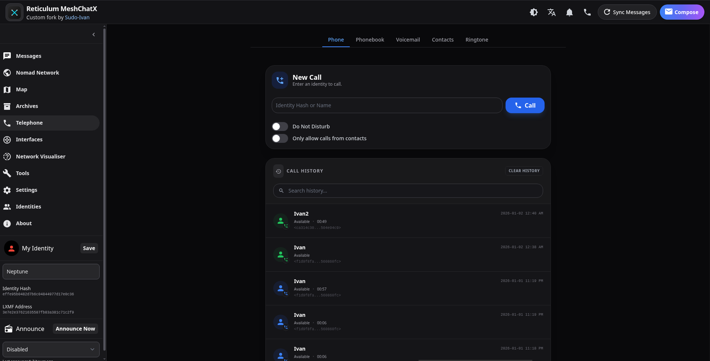
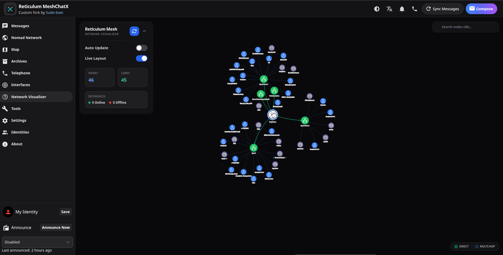
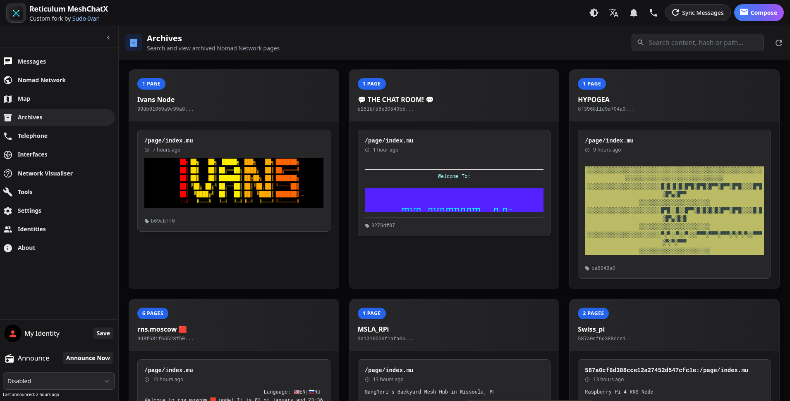
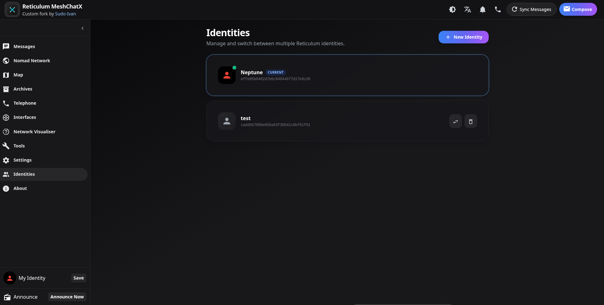

# Reticulum MeshChatX

Un fork ampiamente modificato e ricco di funzionalita di Reticulum MeshChat di Liam Cottle.

Questo progetto e indipendente dal progetto originale Reticulum MeshChat e non e affiliato ad esso.

- Codice sorgente: [git.quad4.io/RNS-Things/MeshChatX](https://git.quad4.io/RNS-Things/MeshChatX)
- Release: [git.quad4.io/RNS-Things/MeshChatX/releases](https://git.quad4.io/RNS-Things/MeshChatX/releases)
- Changelog: [`CHANGELOG.md`](../CHANGELOG.md)
- TODO: [`TODO.md`](../TODO.md)
- [English README](../README.md) | [Deutsch](README.de.md) | [Русский](README.ru.md) | [中文](README.zh.md) | [日本語](README.ja.md)

## Note importanti

- Il supporto completo LXMF e un obiettivo centrale del progetto.
- L'archiviazione e le migrazioni sono state progressivamente rielaborate verso SQL diretto (sostituendo i percorsi legacy Peewee ORM).

> [!WARNING]
> MeshChatX non garantisce la compatibilita dei dati con le versioni precedenti di Reticulum MeshChat. Eseguire un backup prima della migrazione o dei test.

> [!WARNING]
> I sistemi legacy non sono ancora completamente supportati. Requisiti minimi attuali: Python `>=3.11` e Node `>=24`.

## Demo e screenshot

<video src="https://strg.0rbitzer0.net/raw/62926a2a-0a9a-4f44-a5f6-000dd60deac1.mp4" controls="controls" style="max-width: 100%;"></video>

### Interfaccia






## Requisiti

- Python `>=3.11` (da `pyproject.toml`)
- Node.js `>=24` (da `package.json`)
- pnpm `10.30.0` (da `package.json`)
- Poetry (utilizzato in `Taskfile.yml` e nei workflow CI)

## Nix (flake.nix)

Il repository include un Nix flake in `flake.nix`.

### Entrare nella dev shell

```bash
nix develop
```

### Compilare il pacchetto Nix predefinito

```bash
nix build .#default
```

### Flusso di lavoro tipico dentro `nix develop`

```bash
task install
task lint:all
task test:all
task build:all
```

## Metodi di installazione

| Metodo                    | Include frontend     | Architetture                                | Ideale per                                         |
| ------------------------- | -------------------- | ------------------------------------------- | -------------------------------------------------- |
| Immagine Docker           | Si                   | `linux/amd64`, `linux/arm64`                | Avvio rapido su server Linux                       |
| Python wheel (`.whl`)     | Si                   | Qualsiasi architettura supportata da Python | Installazione headless/web-server senza build Node |
| Linux AppImage            | Si                   | `x64`, `arm64`                              | Uso desktop portatile                              |
| Pacchetto Debian (`.deb`) | Si                   | `x64`, `arm64`                              | Installazione Debian/Ubuntu                        |
| Pacchetto RPM (`.rpm`)    | Si                   | Dipende dal CI                              | Fedora/RHEL/openSUSE                               |
| Da sorgente               | Compilato localmente | Architettura host                           | Sviluppo e build personalizzati                    |

Note:

- Il workflow di release compila esplicitamente Linux `x64` e `arm64` AppImage + DEB.
- RPM viene anche tentato e caricato quando prodotto con successo.

## Avvio rapido: Docker

```bash
docker compose up -d
```

Il file compose predefinito mappa:

- `127.0.0.1:8000` sull'host -> porta `8000` del container
- `./meshchat-config` -> `/config` per la persistenza

In caso di errori di permessi:

```bash
sudo chown -R 1000:1000 ./meshchat-config
```

## Installazione da artefatti di release

### 1) Linux AppImage (x64/arm64)

1. Scaricare `ReticulumMeshChatX-v<versione>-linux-<arch>.AppImage` dalle release.
2. Rendere eseguibile e avviare:

```bash
chmod +x ./ReticulumMeshChatX-v*-linux-*.AppImage
./ReticulumMeshChatX-v*-linux-*.AppImage
```

### 2) Debian/Ubuntu `.deb` (x64/arm64)

1. Scaricare `ReticulumMeshChatX-v<versione>-linux-<arch>.deb`.
2. Installare:

```bash
sudo apt install ./ReticulumMeshChatX-v*-linux-*.deb
```

### 3) Sistemi RPM

1. Scaricare `ReticulumMeshChatX-v<versione>-linux-<arch>.rpm` se presente nella release.
2. Installare:

```bash
sudo rpm -Uvh ./ReticulumMeshChatX-v*-linux-*.rpm
```

### 4) Python wheel (`.whl`)

I wheel delle release includono gli asset web compilati.

```bash
pip install ./reticulum_meshchatx-*-py3-none-any.whl
meshchat --headless
```

`pipx` e supportato:

```bash
pipx install ./reticulum_meshchatx-*-py3-none-any.whl
```

## Esecuzione da sorgente (modalita web server)

```bash
git clone https://git.quad4.io/RNS-Things/MeshChatX.git
cd MeshChatX
corepack enable
pnpm install
pip install poetry
poetry install
pnpm run build-frontend
poetry run meshchat --headless --host 127.0.0.1
```

## Compilazione pacchetti desktop da sorgente

### Linux x64 AppImage + DEB

```bash
pnpm run dist:linux-x64
```

### Linux arm64 AppImage + DEB

```bash
pnpm run dist:linux-arm64
```

### RPM

```bash
pnpm run dist:rpm
```

## Supporto architetture

- Docker: `amd64`, `arm64`
- Linux AppImage: `x64`, `arm64`
- Linux DEB: `x64`, `arm64`
- Windows: `x64`, `arm64` (script di build disponibili)
- macOS: script di build disponibili (`arm64`, `universal`)
- Android: progetto e workflow CI presenti nel repository

## Android

- [`docs/meshchatx_on_android_with_termux.md`](../docs/meshchatx_on_android_with_termux.md)
- [`android/README.md`](../android/README.md)

## Configurazione

| Argomento       | Variabile d'ambiente   | Predefinito | Descrizione                           |
| --------------- | ---------------------- | ----------- | ------------------------------------- |
| `--host`        | `MESHCHAT_HOST`        | `127.0.0.1` | Indirizzo del web server              |
| `--port`        | `MESHCHAT_PORT`        | `8000`      | Porta del web server                  |
| `--no-https`    | `MESHCHAT_NO_HTTPS`    | `false`     | Disattiva HTTPS                       |
| `--headless`    | `MESHCHAT_HEADLESS`    | `false`     | Non aprire il browser automaticamente |
| `--auth`        | `MESHCHAT_AUTH`        | `false`     | Attiva autenticazione base            |
| `--storage-dir` | `MESHCHAT_STORAGE_DIR` | `./storage` | Directory dei dati                    |
| `--public-dir`  | `MESHCHAT_PUBLIC_DIR`  | auto        | Directory dei file frontend           |

## Branch

| Branch   | Scopo                                                                     |
| -------- | ------------------------------------------------------------------------- |
| `master` | Release stabili. Solo codice pronto per la produzione.                    |
| `dev`    | Sviluppo attivo. Potrebbe contenere modifiche instabili o incomplete.     |

## Sviluppo

```bash
task install
task lint:all
task test:all
task build:all
```

## Sicurezza

- [`SECURITY.md`](../SECURITY.md)
- Controlli di integrita integrati e HTTPS/WSS predefiniti
- Workflow di scansione CI in `.gitea/workflows/`

## Crediti

- [Liam Cottle](https://github.com/liamcottle) - Reticulum MeshChat originale
- [RFnexus](https://github.com/RFnexus) - Parser Micron JavaScript
- [markqvist](https://github.com/markqvist) - Reticulum, LXMF, LXST
